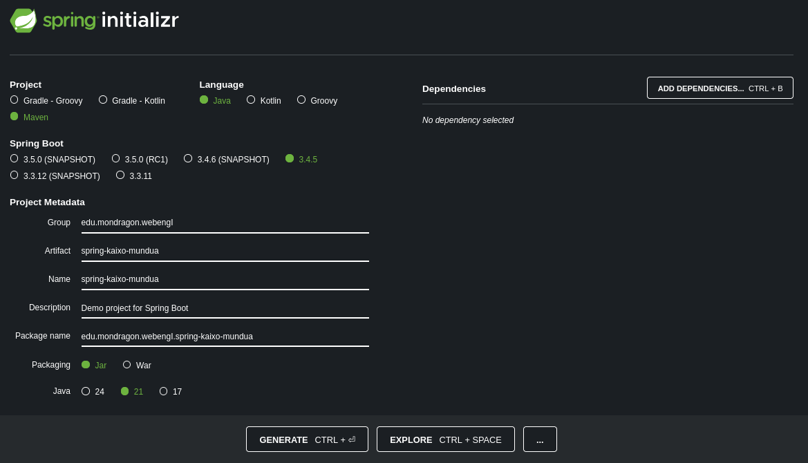
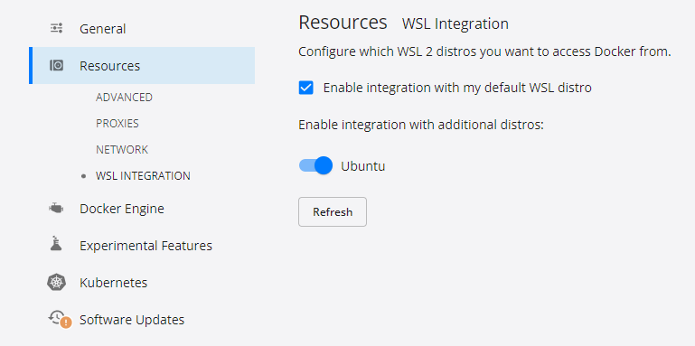

<!---------------------------->
<!-- multilingual suffix: en, es, eu -->
<!-- no suffix: eu -->
<!---------------------------->
<!-- [common] -->
# Devcontainer: Java + MySQL

[eu](README.md) | [es](README.es.md) | [en](README.en.md)

<!-- [en] -->
In this case, instead of having one single container, we will have two containers:

1. **DevContainer**: This is the container where we will develop our Java application (same as in class).
2. **MySQL**: This is the container where we will run our MySQL database.

You can see that in `.devcontainer/compose.yml` file, we have two services: `java-app` and `mysql`.

<!-- [es] -->
En este caso, en lugar de tener un solo contenedor, tendremos dos contenedores:
1. **DevContainer**: Este es el contenedor donde desarrollaremos nuestra aplicación Java (igual que en clase).
2. **MySQL**: Este es el contenedor donde ejecutaremos nuestra base de datos MySQL.
Puedes ver que en el archivo `.devcontainer/compose.yml` tenemos dos servicios: `java-app` y `mysql`.

<!-- [eu] -->
Oraingo honetan, kontenedore bakar bat izan beharrean, bi kontenedore izango ditugu:
1. **DevContainer**: Hemen garatuko dugu gure Java aplikazioa (klasean bezala).
2. **MySQL**: Hemen exekutatuko dugu gure MySQL datu-basea.

Ikusi daiteke `.devcontainer/compose.yml` fitxategian bi zerbitzu ditugula: `java-app` eta `mysql`.

<!-- [en] -->
## Try it

* Open project in devcontainer.

<!-- [es] -->
## Pruebalo

* Abre el proyecto en devcontainer.

<!-- [eu] -->
## Probatu

* Ireki proiektua devcontainer moduan.

<!-- [common] -->
### MySQL

<!-- [en] -->
Once the container is created, test MySQL connection:

<!-- [es] -->
Una vez creado el contenedor, prueba la conexión a MySQL:

<!-- [eu] -->
Behin kontenedorea sortuta, probatu MySQL konexioa:

<!-- [common] -->
```bash
mysql -h mysql -u root -p
```

<!-- [en] -->
* Insert `pasahitza` as password.
* Execute the commandts to check that **pbl** database exists:

<!-- [es] -->
* Inserta `pasahitza` como contraseña.
* Ejecuta los comandos para comprobar que existe la base de datos **pbl**:

<!-- [eu] -->
* Sartu `pasahitza` pasahitz gisa.
* Exekutatu komandoak **pbl** datu-basea existitzen dela egiaztatzeko:

<!-- [common] -->
```sql
show databases;
```
<!-- [en] -->
* You should see the following output:

<!-- [es] -->
* Deberías ver la siguiente salida:

<!-- [eu] -->
* Irteera hau ikusi beharko zenuke:

<!-- [common] -->
```sql
+--------------------+
| Database           |
+--------------------+
| information_schema |
| mysql              |
| pbl                |
| performance_schema |
| sys                |
+--------------------+
5 rows in set (0.01 sec)
```

### SpringBoot

<!-- [en] -->
Now you can go to [Spring Initializr](https://start.spring.io/), create your own SpringBoot application and run it in the devcontainer.

<!-- [es] -->
Ahora puedes ir a [Spring Initializr](https://start.spring.io/), para crear tu propia aplicación SpringBoot y ejecutarla en el devcontainer.

<!-- [eu] -->
Orain [Spring Initializr](https://start.spring.io/)era joan zaitezke, zure SpringBoot aplikazioa sortzeko eta devcontainerean exekutatzeko.

<!-- [common] -->


<!-- [en] -->
* Unzip the content into the workspace folder.

#### Download dependencies

<!-- [es] -->
* Descomprime el contenido en la carpeta de trabajo.

#### Descargar dependencias

<!-- [eu] -->
* Deskargatu edukia worspaceko karpetan.

#### Dependentziak deskargatu

<!-- [common] -->
```bash
mvn clean install
```

<!-- [en] -->
#### Run the application

* Open the java file on the `src/**` folder, add a breakpoint inside the `main` method and run the application pressing **F5**.
* It should stop at the breakpoint.

> You can also reate a `launch.json` file to run the application so you don't need to have main java class oppened. Go to the **Run and Debug** tab, click on **create a launch.json file** and select Java.

<!-- [es] -->
#### Ejecutar la aplicación

* Abre el archivo java en la carpeta `src/**`, añade un punto de interrupción dentro del método `main` y ejecuta la aplicación pulsando **F5**.
* Debería detenerse en el punto de interrupción.

> También puedes crear un archivo `launch.json` para ejecutar la aplicación, así no necesitas tener la clase java principal abierta. Ve a la pestaña **Ejecutar y depurar**, haz clic en **crear un archivo launch.json** y selecciona Java.

<!-- [eu] -->
#### Exekutatu aplikazioa
* Ireki `src/**` karpetako java fitxategia, gehitu *breakpoint* bat `main` metodoaren barruan eta exekutatu aplikazioa **F5** sakatuz.
* *breakpoint*ean gelditu beharko litzateke.

> `launch.json` fitxategia sor dezakezu aplikazioa exekutatzeko, java klase nagusia irekita eduki beharrik ez izateko. Joan **Run and Debug** fitxara, egin klik **launch.json fitxategi bat sortu** eta hautatu Java.

<!-- [en] -->
## Conclusion

You have created a devcontainer with Java and MySQL. You can use this devcontainer to develop your Java application and run it in the devcontainer. You can also use MySQL to store your data.

Now you can start coding your application. You may need to add dependencies in the future to add advanced functionalities.

> **WARNING**: if you are using this repo to start your project, make sure to delete the `.git` folder and the `.gitignore` file before pushing your code to your own repository. Otherwise you will not upload your code to your own repository.

<!-- [es] -->
## Conclusión

Has creado un devcontainer con Java y MySQL. Puedes usar este devcontainer para desarrollar tu aplicación Java y ejecutarla. También puedes usar MySQL para almacenar tus datos.

Ahora puedes empezar a desarrollar tu aplicación. Es posible que necesites añadir dependencias en el futuro para añadir funcionalidades avanzadas.

> **ADVERTENCIA**: si estás usando este repositorio para empezar tu proyecto, asegúrate de eliminar la carpeta `.git` y el archivo `.gitignore` antes de subir tu código a tu propio repositorio. De lo contrario, no subirás tu código.

<!-- [eu] -->
## Ondorioa

Devcontainer bat sortu duzu Java eta MySQL-rekin. Devcontainer hau Java aplikazioa garatzeko eta exekutatzeko erabil dezakezu. MySQL ere erabili dezakezu zure datuak gordetzeko.

Orain aplikazioa garatzen hasi zaitezke. Etorkizunean, funtzionalitate aurreratuak gehitzeko, dependentziak gehitu beharko dituzu.

> **OHARRA**: proiektu hau hasteko erabili baduzu, ziurtatu `.git` karpeta eta `.gitignore` fitxategia ezabatzen dituzula zure kodea zure errepositorio propioan igo aurretik. Bestela, ez duzu zure kodea igoko.


<!-- [en] -->
## Increase speed in Windows

* Open your terminal and run the following command:

<!-- [es] -->
## Aumentar la velocidad en Windows

* Abre tu terminal y ejecuta el siguiente comando:

<!-- [eu] -->
## Handitu abiadura Windows-en

* Ireki zure terminala eta exekutatu hurrengo komandoa:

<!-- [common] -->
```bash
wsl --install
```

or

```bash
wsl --install --distribution Ubuntu-24.04
```

<!-- [en] -->
* Go to your Docker Desktop settings and enable WSL integration to just installed ubuntu distribution.


<!-- [es] -->
* Ve a la configuración de Docker Desktop y habilita la integración WSL para la distribución de ubuntu recién instalada.

<!-- [eu] -->
* Joan Docker Desktop-en konfiguraziora eta aktibatu WSL integrazioa Ubuntu distribuzio berrian.

<!-- [common] -->


<!-- [en] -->
* Restart your computer.
* Open your terminal, click on the arrow and select **Ubuntu**.
* A new user will be created. Follow the instructions to create a new user and remember the password.
* Once you are inside ubuntu terminal
  * Create a new folder called `git`
  * Clone this repository inside it.
  * Open the folder in VSCode.

<!-- [es] -->
* Reinicia tu ordenador.
* Abre tu terminal, haz clic en la flecha y selecciona **Ubuntu**.
* Se creará un nuevo usuario. Sigue las instrucciones para crear un nuevo usuario y recuerda la contraseña.
* Una vez dentro de la terminal de ubuntu
  * Crea una nueva carpeta llamada `git`
  * Clona este repositorio dentro de ella.
  * Abre la carpeta en VSCode.

<!-- [eu] -->
* Birabiarazi ordenagailua.
* Ireki zure terminala, egin klik geziaren gainean eta hautatu **Ubuntu**.
* Erabiltzaile berri bat sortuko da. Jarraitu argibideak erabiltzaile berri bat sortzeko eta gogoratu pasahitza.
* Ubuntu terminalean zaudenean
  * Sortu `git` izeneko karpeta berri bat
  * Klonatu errepo hau bertan.
  * Ireki karpeta VSCode-n.

<!-- [common] -->
```bash
cd ~
mkdir git
cd git
git clone https://gitlab.com/mgep-web-ingeniaritza-1/pbl/spring-devcontainer-kaixo-mundua.git
cd spring-devcontainer-kaixo-mundua
code .
```

<!-- [en] -->
* This will open the project in your VSCode.
* Now, as in previous examples, reopen the project in devcontainer.

<!-- [es] -->
* Esto abrirá el proyecto en tu VSCode.
* Ahora, como en los ejemplos anteriores, vuelve a abrir el proyecto en devcontainer.

<!-- [eu] -->
* Honek proiektua zure VSCode-n irekiko du.
* Orain, aurreko adibideetan bezala, ireki proiektua devcontainer moduan.
