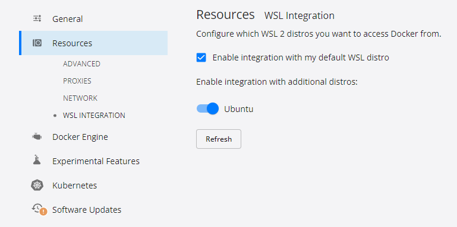

# Devcontainer: Java + MySQL

[eu](README.md) | [es](README.es.md) | [en](README.en.md)

In this case, instead of having one single container, we will have two containers:

1. **DevContainer**: This is the container where we will develop our Java application (same as in class).
2. **MySQL**: This is the container where we will run our MySQL database.

You can see that in `.devcontainer/compose.yml` file, we have two services: `java-app` and `mysql`.

## Try it

* Open project in devcontainer.

### MySQL

Once the container is created, test MySQL connection:

```bash
mysql -h mysql -u root -p
```

* Insert `pasahitza` as password.
* Execute the commandts to check that **pbl** database exists:

```sql
show databases;
```
* You should see the following output:

```sql
+--------------------+
| Database           |
+--------------------+
| information_schema |
| mysql              |
| pbl                |
| performance_schema |
| sys                |
+--------------------+
5 rows in set (0.01 sec)
```

### SpringBoot

Now you can go to [Spring Initializr](https://start.spring.io/), create your own SpringBoot application and run it in the devcontainer.


* Unzip the content into the workspace folder.

#### Download dependencies

```bash
mvn clean install
```

#### Run the application

* Open the java file on the `src/**` folder, add a breakpoint inside the `main` method and run the application pressing **F5**.
* It should stop at the breakpoint.

> You can also reate a `launch.json` file to run the application so you don't need to have main java class oppened. Go to the **Run and Debug** tab, click on **create a launch.json file** and select Java.

## Conclusion

You have created a devcontainer with Java and MySQL. You can use this devcontainer to develop your Java application and run it in the devcontainer. You can also use MySQL to store your data.

Now you can start coding your application. You may need to add dependencies in the future to add advanced functionalities.

> **WARNING**: if you are using this repo to start your project, make sure to delete the `.git` folder and the `.gitignore` file before pushing your code to your own repository. Otherwise you will not upload your code to your own repository.

## Increase speed in Windows

* Open your terminal and run the following command:

```bash
wsl --install
```

or

```bash
wsl --install --distribution Ubuntu-24.04
```

* Go to your Docker Desktop settings and enable WSL integration to just installed ubuntu distribution.




* Restart your computer.
* Open your terminal, click on the arrow and select **Ubuntu**.
* A new user will be created. Follow the instructions to create a new user and remember the password.
* Once you are inside ubuntu terminal
  * Create a new folder called `git`
  * Clone this repository inside it.
  * Open the folder in VSCode.

```bash
cd ~
mkdir git
cd git
git clone https://gitlab.com/mgep-web-ingeniaritza-1/pbl/spring-devcontainer-kaixo-mundua.git
cd spring-devcontainer-kaixo-mundua
code .
```

* This will open the project in your VSCode.
* Now, as in previous examples, reopen the project in devcontainer.
