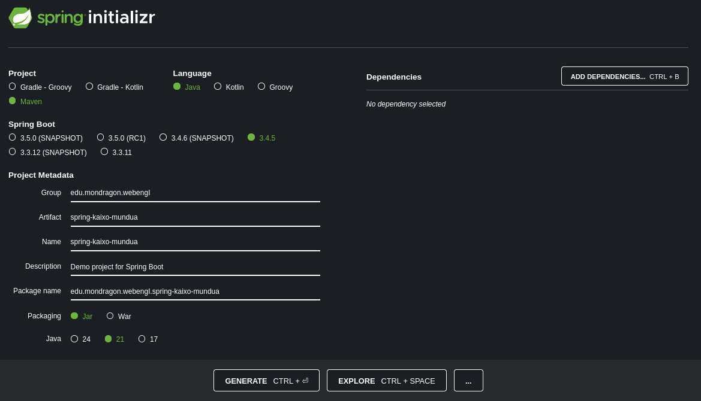

# Devcontainer: Java + MySQL

[eu](README.md) | [es](README.es.md) | [en](README.en.md)

En este caso, en lugar de tener un solo contenedor, tendremos dos contenedores:
1. **DevContainer**: Este es el contenedor donde desarrollaremos nuestra aplicación Java (igual que en clase).
2. **MySQL**: Este es el contenedor donde ejecutaremos nuestra base de datos MySQL.
Puedes ver que en el archivo `.devcontainer/compose.yml` tenemos dos servicios: `java-app` y `mysql`.

## Pruebalo

* Abre el proyecto en devcontainer.

### MySQL

Una vez creado el contenedor, prueba la conexión a MySQL:

```bash
mysql -h mysql -u root -p
```

* Inserta `pasahitza` como contraseña.
* Ejecuta los comandos para comprobar que existe la base de datos **pbl**:

```sql
show databases;
```
* Deberías ver la siguiente salida:

```sql
+--------------------+
| Database           |
+--------------------+
| information_schema |
| mysql              |
| pbl                |
| performance_schema |
| sys                |
+--------------------+
5 rows in set (0.01 sec)
```

### SpringBoot

Ahora puedes ir a [Spring Initializr](https://start.spring.io/), para crear tu propia aplicación SpringBoot y ejecutarla en el devcontainer.



* Descomprime el contenido en la carpeta de trabajo.

#### Descargar dependencias

```bash
mvn clean install
```

#### Ejecutar la aplicación

* Abre el archivo java en la carpeta `src/**`, añade un punto de interrupción dentro del método `main` y ejecuta la aplicación pulsando **F5**.
* Debería detenerse en el punto de interrupción.

> También puedes crear un archivo `launch.json` para ejecutar la aplicación, así no necesitas tener la clase java principal abierta. Ve a la pestaña **Ejecutar y depurar**, haz clic en **crear un archivo launch.json** y selecciona Java.

## Conclusión

Has creado un devcontainer con Java y MySQL. Puedes usar este devcontainer para desarrollar tu aplicación Java y ejecutarla. También puedes usar MySQL para almacenar tus datos.

Ahora puedes empezar a desarrollar tu aplicación. Es posible que necesites añadir dependencias en el futuro para añadir funcionalidades avanzadas.

> **ADVERTENCIA**: si estás usando este repositorio para empezar tu proyecto, asegúrate de eliminar la carpeta `.git` y el archivo `.gitignore` antes de subir tu código a tu propio repositorio. De lo contrario, no subirás tu código.

## Aumentar la velocidad en Windows

* Abre tu terminal y ejecuta el siguiente comando:

```bash
wsl --install
```

or

```bash
wsl --install --distribution Ubuntu-24.04
```

* Ve a la configuración de Docker Desktop y habilita la integración WSL para la distribución de ubuntu recién instalada.


* Reinicia tu ordenador.
* Abre tu terminal, haz clic en la flecha y selecciona **Ubuntu**.
* Se creará un nuevo usuario. Sigue las instrucciones para crear un nuevo usuario y recuerda la contraseña.
* Una vez dentro de la terminal de ubuntu
  * Crea una nueva carpeta llamada `git`
  * Clona este repositorio dentro de ella.
  * Abre la carpeta en VSCode.

```bash
cd ~
mkdir git
cd git
git clone https://gitlab.com/mgep-web-ingeniaritza-1/pbl/spring-devcontainer-kaixo-mundua.git
cd spring-devcontainer-kaixo-mundua
code .
```

* Esto abrirá el proyecto en tu VSCode.
* Ahora, como en los ejemplos anteriores, vuelve a abrir el proyecto en devcontainer.
